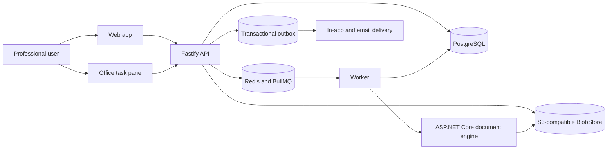

# Target architecture

Status: accepted Phase 0 direction. Changes require a superseding ADR before implementation diverges.

## Decision summary

MergeCom will be a TypeScript-led pnpm/Turborepo monorepo. The product API will be Fastify with TypeBox/OpenAPI contracts, Drizzle, and PostgreSQL. Durable orchestration will use BullMQ with Redis. Artifact storage will use an S3-compatible `BlobStore`, with MinIO locally and managed object storage for hosted environments. Identity will use Microsoft Entra ID through OIDC. Office package inspection, normalization, validation, diff, and conservative merge will run in a separate ASP.NET Core service using the official Open XML SDK.

The current `server.js` will not become the production API. The Word, PowerPoint, and Excel add-ins are technical spikes. Their reconstruction-based push/pull behavior will be replaced by capture and retrieval of exact compressed Office package bytes.

## Target repository

```text
apps/
  web/                    React application migrated from the attached frontend
  office-addin/           shared task pane and host adapters
services/
  api/                    Fastify, TypeBox/OpenAPI, Drizzle
  worker/                 BullMQ orchestration and outbox delivery
  document-engine/        ASP.NET Core and Open XML SDK
packages/
  contracts/              generated API client and shared schemas
  office-core/            exact file capture, upload, identity, host adapters
  test-fixtures/          reviewed synthetic Office packages and golden outputs
  ui/                     shared web/task-pane design primitives
infra/
  compose/                PostgreSQL, MinIO, Redis, local mail catcher
  deployment/             hosted environment definitions
docs/
  adr/ product/ runbooks/ security/
legacy/
  office-spikes/          read-only prototype evidence
  server-prototype/       read-only behavior reference
```

One root `pnpm-lock.yaml` and root scripts will own the JavaScript/TypeScript build graph. The .NET service remains in the same repository and participates in the same CI gates.

## System flow



## Component responsibilities

| Component | Owns | Does not own |
| --- | --- | --- |
| Web app | Projects, history, compare, reviews, administration, external review UI | Authorization decisions or artifact persistence |
| Office add-in | Host identity, exact package capture where supported, base-version context, push/status/open flows | Semantic source of truth or file reconstruction |
| API | OIDC session boundary, tenant/resource authorization, commands, queries, signed upload/download, idempotency, audit creation | CPU-heavy Office parsing or inline email delivery |
| PostgreSQL | Tenant-owned metadata, version graph, review state, job/outbox state, audit pointers | Office package bytes or large snapshots |
| BlobStore | Immutable originals, normalized snapshots, previews, diff/merge outputs, exports | User authorization decisions |
| Worker | Durable job leases, retries, idempotent orchestration, dead-letter handling | Public client access |
| Document engine | Bounded OOXML inspection, normalized snapshots, typed diff, validation, conservative merge | Authentication, tenant policy, or direct public access |
| Outbox delivery | Reliable in-app/email delivery and retry | Sending inside domain database transactions |

## Artifact invariant

Every accepted version references an immutable artifact containing the exact uploaded Office package bytes. The artifact record includes organization ownership, object key, SHA-256, byte size, media type, extension, scan status, and encryption metadata. Duplicate storage may be content-addressed, but authorization remains tenant/resource scoped.

Normalized snapshots, previews, and diffs are versioned derived artifacts. They may be regenerated. They are never used to manufacture a download, pull, restore, or rollback file.

## Request and processing boundaries

1. The API authorizes a command and creates an idempotent upload intent.
2. The client uploads exact bytes to a constrained object key using a short-lived signed request.
3. Finalization verifies size, media type, and SHA-256, creates an immutable version, and enqueues processing transactionally.
4. A worker leases the job and asks the internal document engine to process a bounded input in an isolated temporary directory.
5. Scan, normalization, diff, and preview statuses are persisted honestly. Failed or quarantined artifacts are never presented as ready.
6. Download/pull authorizes the requested version and returns exact original bytes through an expiring URL.

## Data and authorization rules

- Every tenant-owned row contains or is unambiguously linked to `organization_id`.
- The client never chooses an authoritative role, organization, owner, version author, or artifact key.
- Project/document/version access is enforced server-side for every read and command.
- Version creation records branch, parent, optional merge parent, base version, author, source, note, sequence, and immutable artifact.
- Audit events record actor, organization, action, target, result, request/trace identifier, and timestamp without document content.

## Local and hosted environments

Local development uses Docker Compose for PostgreSQL, MinIO, Redis, and a mail
catcher. Bootstrap requires one documented command and no committed secret. The Phase
15 pilot bundle runs only stateless application images and requires managed
PostgreSQL, Redis, object storage, SMTP, Entra ID, TLS ingress, secret management,
monitoring, and backups. Images are selected by digest and database migration is a
successful one-shot prerequisite for API and worker startup. A later Microsoft 365
storage connector may allow SharePoint/OneDrive to remain the file system of record
without changing version semantics.

## Security posture

- OIDC authorization code flow with PKCE and secure server-managed sessions.
- No application password database for primary users.
- Short-lived scoped upload/download grants; object storage is not public.
- Bounded file size, package part count, compression ratio, XML depth, and processing time.
- Defenses for path traversal, malformed relationships/content types, DTD/external entities, encrypted packages, and unsupported features.
- Restricted worker/document-engine network and filesystem permissions with guaranteed temporary-file cleanup.
- Document content is excluded from application logs, errors, traces, analytics, and audit payloads.
